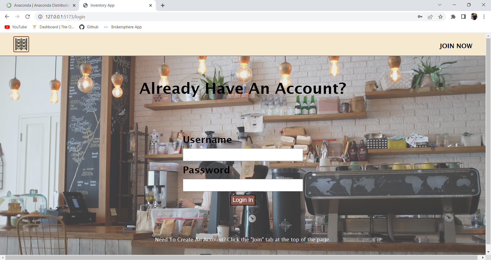

# Inventory App
<small>Allows small business owners a tool to manage their inventory in a simple way.</small>

This full stack web application was created to help my wife manage her furniture flipping business.

## Stack

* Frontend - Vite Build Tool / ReactJS
* Backend - Express and MongoDB
* Cloud Hosting - Undecided (currently Heroku)

### Here are the main features the site will offer:

1. Input and manage inventory items
2. Create projects in which you can take notes, estimate project costs, and track what inventory items are needed to complete the project.
3. Get a summary/snapshot of your inventory and projects

The site is still in development and currently have just implemented the layout and pages, user authetication and creation.

### Goals

My goal with this project is to show my ability to do the following:

* Build dynamic frontend experiences with ReactJS
* Demonstrate my understanding of hooks and functional components
* Build secure and useful APIs
* Solve problems